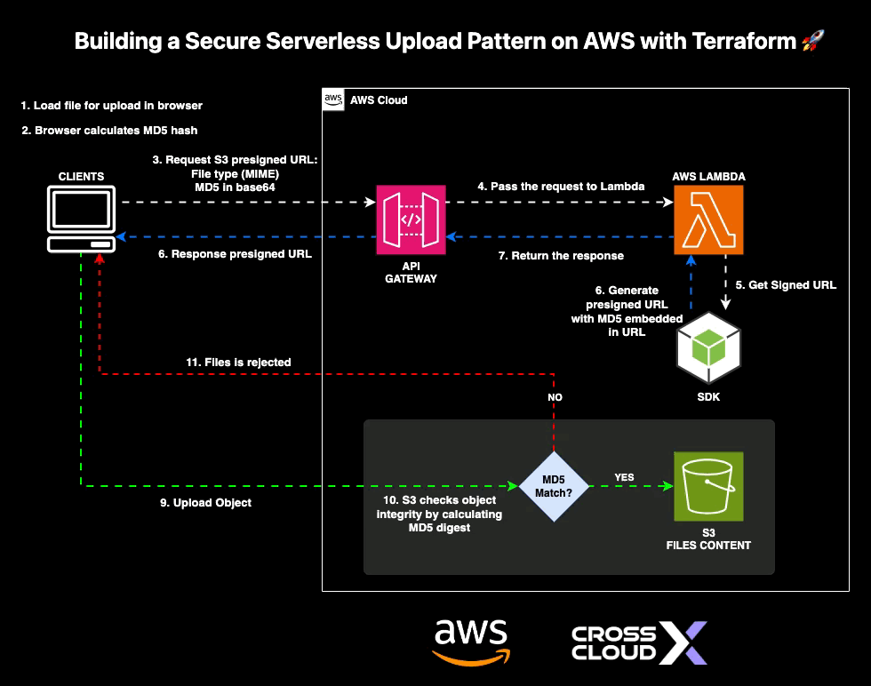
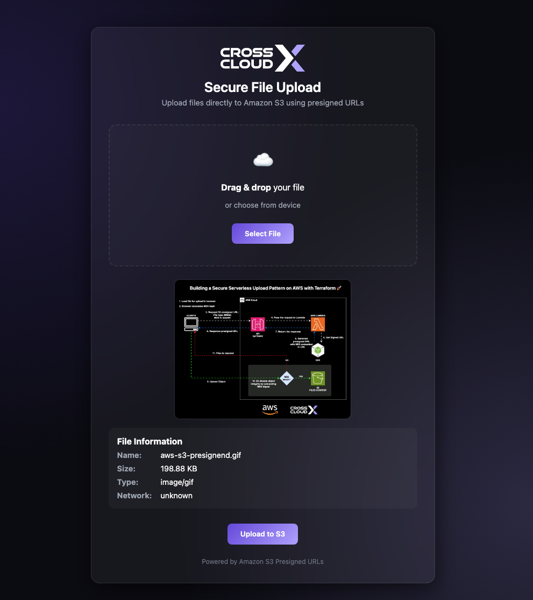

# 🚀 Secure File Upload to Amazon S3 with Presigned URLs (Serverless)

A **serverless architecture** that allows clients to upload files **directly to Amazon S3** using **presigned URLs**, reducing backend load and improving scalability.

This project demonstrates how to build a **secure file upload pipeline** using:

- AWS Lambda
- Amazon API Gateway
- Amazon S3
- Terraform (Infrastructure as Code)
- DevSecOps security scanning (Checkov + Trivy)

---

## 🧠 Architecture Overview

The client requests a **presigned upload URL** from an API endpoint.  
A **Lambda function** generates the URL and returns it to the client.  
The client then uploads the file **directly to S3**.

### Flow

1. Client selects a file in the web UI
2. Client calculates the **MD5 checksum**
3. Client calls the API Gateway endpoint
4. Lambda generates a **presigned PUT URL**
5. Client uploads the file directly to **S3**

This architecture avoids routing file uploads through the backend.

---

## ⚙️ Prerequisites

Make sure you have installed:

- Terraform
- AWS CLI
- Node.js
- Checkov
- Trivy
- Infracost (optional)

---

## 📸 Demo

Uploading a file from the browser UI:

---

## 🚀 Deploy Infrastructure

The project uses Terraform + Makefile automation.

| Command | Description |
|---------|-------------|
| `make tf-init` | Initialize Terraform |
| `make tf-plan` | Plan Infrastructure |
| `make tf-apply` | Apply Infrastructure |
| `make tf-destroy` | Destroy Infrastructure |

---

## 🔐 DevSecOps Security Scanning

The project integrates Infrastructure Security Scans.

| Command | Description |
|---------|-------------|
| `make sec-iac` | Scan Terraform Plan (Checkov) |
| `make sec-fs` | Scan Source Code (Trivy) |
| `make sec-all` | Run All Security Scans |

**Checkov scans for:**
- S3 security configuration
- IAM policies
- Encryption best practices

**Trivy scans for:**
- Node.js dependencies
- Vulnerabilities
- Misconfigurations

---

## 💰 Cost Estimation (FinOps)

This project includes Infracost integration.

| Command | Description |
|---------|-------------|
| `make infracost` | Estimate infrastructure cost |
| `make infracost-html` | Generate HTML report |

---

## 📂 Client Application

The demo client is a simple HTML application that:

1. Selects a file
2. Computes its MD5 hash
3. Requests a presigned URL
4. Uploads directly to S3

**Location:** `client/index.html`